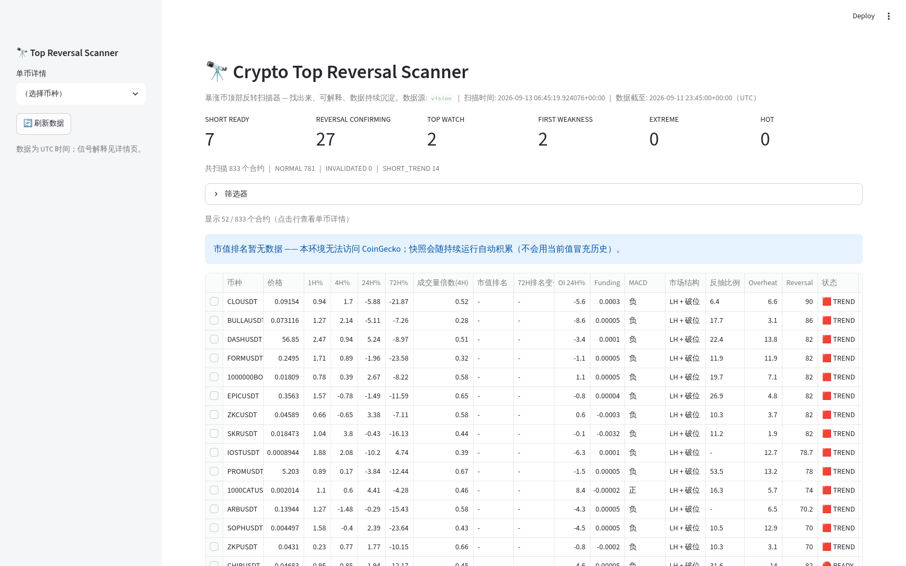
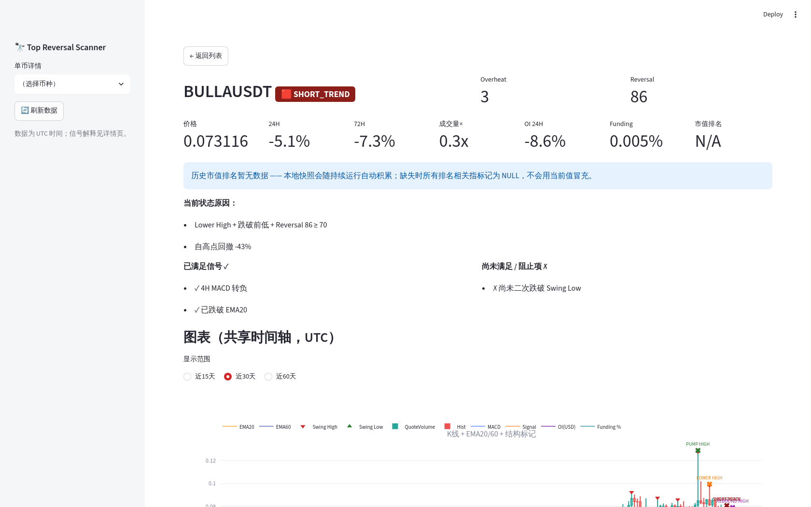
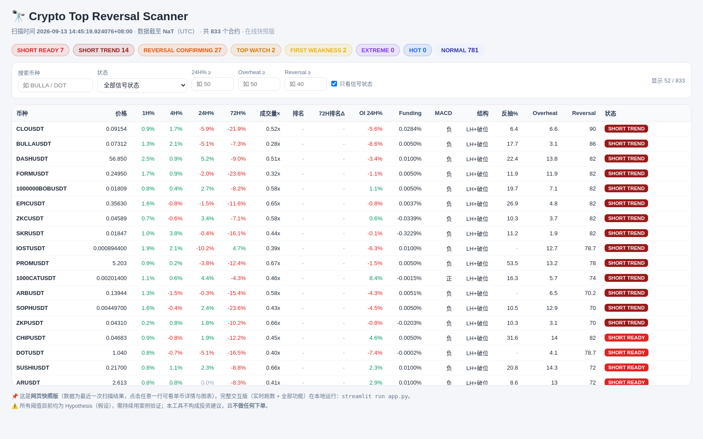

# 🔭 Crypto Top Reversal Scanner（暴涨币顶部反转扫描器）

扫描 Binance U 本位永续合约，找出「近期暴涨 → 过热 → 首次转弱 → 疑似见顶 → 反转确认」的币种，
并用可解释的评分告诉你是 **SHORT READY**，还是只是 **TOP WATCH**（观察，不是做空信号）。

> ⚠️ 本项目 **不做自动下单**、不含交易权限，只做「找出来 + 可解释 + 数据沉淀」。
> 所有阈值目前都是 **Hypothesis（假设）**，需要用成功/失败案例持续验证后再谈策略。

### 界面预览

| 扫描总览 | 单币详情（含信号解释与六联图） | 在线预览版（GitHub Pages） |
|---|---|---|
|  |  |  |

### 🌐 在线访问

- **仓库**：https://github.com/atwu5/crypto-top-scanner
- **网页快照版（GitHub Pages）**：`https://atwu5.github.io/crypto-top-scanner/`
  —— 打开即看最新扫描快照（全市场筛选表 + 单币图表 + 信号解释）。
  > ⚠️ **首次使用需启用（仅一次，约 10 秒）**：仓库 → Settings → Pages →
  > Source 选 “Deploy from a branch” → Branch 选 `main`、文件夹选 `/docs` → Save。
  > 约 1 分钟后即可访问上面地址。
  更新方式：`python scripts/build_online_preview.py` 后提交 `docs/`（或让扫描流程自动带上）。
- **完整交互版（Streamlit）**，两种方式：
  1. 本机运行：`streamlit run app.py`（最推荐，数据实时增量更新）；
  2. 免费云端部署：到 [share.streamlit.io](https://share.streamlit.io) 用 GitHub 登录 → New app →
     选仓库 `atwu5/crypto-top-scanner`、主文件 `app.py` → Deploy，即可获得一个可分享的在线地址（首次打开若无数据，运行一次 `python scripts/init_data.py` 或等待默认数据更新）。

### 🚀 换一台电脑怎么跑（快速开始）

```bash
# 0) 装好 Python 3.10+
git clone https://github.com/atwu5/crypto-top-scanner.git
cd crypto-top-scanner
# 1) 安装依赖
pip install -r requirements.txt
# 2) 数据：仓库内置合并数据包（data_pack/），还原成运行时布局：
python scripts/restore_data_pack.py
#    （也可以跳过这步，直接 `python scripts/init_data.py` 从 Binance 重新拉）
# 3) 直接扫描（增量，只补最新数据）
python main.py scan
# 4) 打开网页
streamlit run app.py
```

- 数据包为普通文件（**无需 Git LFS**），clone 即含全市场历史数据；
- 想要一直用最新行情：`python scripts/update_data.py` 增量更新；更新后可 `python scripts/pack_data.py` 重新打包并提交（见第 11 节）；
- 依赖版本参考：`requirements-lock.txt`（本机验证过的完整环境快照）。

---

## 1. 它是怎么工作的（一句话版）

1. 下载/更新 Binance 全市场合约行情（K线、Funding、持仓量 OI、市值排名快照）；
2. 给每个币计算：涨幅、上涨速度衰减、成交量倍数、量价背离、MACD、EMA、RSI、价格结构（Swing High/Low）、
   反抽强度（rebound ratio）、OI 变化、Funding 分位、市值排名变化；
3. 打出两张分：
   - **Overheat Score（0-100）**：这个币是否处于异常暴涨阶段；
   - **Reversal Score（0-100）**：顶部反转证据强度（结构 > MACD）；
4. 用状态机给出最终状态，并 **逐条解释为什么**：

```text
NORMAL → HOT → EXTREME → TOP_WATCH / FIRST_WEAKNESS → REVERSAL_CONFIRMING → SHORT_READY → SHORT_TREND
                                                        （中途若重新创新高 → INVALIDATED）
```

| 状态 | 含义 | 你要做什么 |
|---|---|---|
| NORMAL | 无近期暴涨背景，不在目标范围 | 忽略 |
| HOT | 进入过热观察（Overheat ≥ 50） | 加入观察列表 |
| EXTREME | 异常暴涨中（Overheat ≥ 70） | 高度关注，等转弱 |
| TOP_WATCH | MACD 第一次转弱（仅观察，绝不能直接做空） | 等更多证据 |
| FIRST_WEAKNESS | 出现更多转弱迹象（减速/跌破 EMA20/量价背离） | 开始盯反抽 |
| REVERSAL_CONFIRMING | 结构开始转弱（LH / 跌破 Swing Low），等待确认 | 检查是否被 Blockers 拦截 |
| SHORT_READY | Lower High + 跌破前低 + Reversal 达标，且无拦截项 | 信号最完整，人工复核 |
| SHORT_TREND | 信号确认后已明显下行（回撤已深） | 视为「已在趋势中」 |
| INVALIDATED | 价格重新创新高，顶部信号失效（假顶部过滤） | 放弃本次空头逻辑 |

---

## 2. 安装 Python（零基础看这里）

- **Windows**：到 [python.org](https://www.python.org/downloads/) 下载 Python 3.11+，
  安装时务必勾选 **“Add python.exe to PATH”**。装完打开「命令提示符」输入 `python --version` 验证。
- **macOS**：终端执行 `brew install python@3.11`（需先装 Homebrew），或到官网下载安装包。
- **Linux**：`sudo apt install python3 python3-pip`

验证：命令行输入 `python3 --version`（Windows 用 `python --version`），能显示 3.10 以上即可。

## 3. 安装依赖

```bash
cd crypto-top-scanner
pip install -r requirements.txt
```

> 国内网络建议加镜像：`pip install -r requirements.txt -i https://mirrors.aliyun.com/pypi/simple/`

## 4. 配置 .env（可选）

```bash
cp .env.example .env      # Windows: copy .env.example .env
```

一般不用改。只有当你要**强制指定数据源**或**走代理**时才需要：
- `CTSCAN_DATA_SOURCE=auto|fapi|vision`：
  - `auto`（默认）：先探测 `fapi.binance.com`，直连不通时自动切换 `data.binance.vision` 公共数据归档；
  - `fapi`：只用 Binance 期货 REST 接口；
  - `vision`：只用公共数据归档（无需任何 API Key）。
- 需要代理时填 `HTTPS_PROXY=http://127.0.0.1:端口`。

## 5. 初始化数据（第一次运行）

```bash
python scripts/init_data.py
```

- 拉取当前全部 USDT 永续合约列表；
- 按 `config/scanner.yaml` 中 `lookback` 设置回补历史（4h 四个月 / 1h 四十天 / 15m 八天 / Funding 四个月 / OI 八天）；
- 下载会按币种并行进行，全市场第一次大约需要几十分钟（取决于网络）；之后只增量。

## 6. 执行扫描

```bash
python main.py scan
```

- **增量**：本地已有的数据不会重复下载，只补齐缺失部分；重复执行不会产生重复数据；
- 终端会输出候选列表（按 SHORT_READY ↓ REVERSAL_CONFIRMING ↓ TOP_WATCH ↓ EXTREME 排序）；
- 每次扫描结果都会保存（DuckDB + `data/processed/scans/` 下的 parquet 快照）。

常用参数：

```bash
python main.py scan --no-update          # 只用本地数据扫描（不下载）
python main.py scan --top 100            # 输出前 100 行
python main.py scan --symbols LSKUSDT,UAIUSDT   # 只扫指定币
python scripts/update_data.py            # 只更新数据不扫描
```

## 7. 打开网页

```bash
streamlit run app.py
```

浏览器自动打开（默认 http://localhost:8501 ）：

- **首页**：各状态数量统计 + 全市场主表格，支持搜索 / 状态 / 24H涨幅 / Overheat / Reversal / 市值排名筛选；
- **点击任意一行** → **单币详情**：
  - 顶部：Overheat / Reversal / 状态徽章；
  - 信号解释：✓ 已满足什么、✗ 还差什么、被哪些 Short Blockers 拦截；
  - 六联图（共享时间轴）：K线+EMA20/60+Swing标记+事件标记 / Volume / MACD / OI / Funding / 市值排名。

## 8. 数据保存在哪里

本地运行布局：

```text
data/
├── raw/
│   ├── klines/{symbol}/{interval}/YYYY-MM.parquet   # K线（月分区）
│   ├── funding/{symbol}/{symbol}.parquet            # Funding
│   ├── open_interest/{symbol}/{symbol}.parquet      # OI（持仓量）
│   ├── taker/{symbol}/{symbol}.parquet              # 主动买卖比
│   └── market_cap/snapshots/YYYY-MM.parquet         # 市值排名快照（每次扫描一份）
├── processed/
│   ├── case_analysis.csv        # 样本分析结果
│   ├── symbol_map.csv           # Binance symbol ↔ CoinGecko 映射
│   ├── unresolved_symbols.csv   # 没匹配上的 symbol（可人工在 config 里补映射）
│   ├── scan_meta.json           # 最近一次扫描的元信息
│   └── scans/scan_*.parquet     # 每次扫描完整结果
└── scanner.duckdb               # DuckDB 查询层（视图 + scan_results / case_analysis 表）
```

仓库分发格式：**`data_pack/`**（合并数据包，约 110MB / 35 个文件）——克隆后运行 `python scripts/restore_data_pack.py` 即可还原成上面的 `data/raw` 布局；`data_pack/` 由 `python scripts/pack_data.py` 生成。

查询示例（DuckDB 已建好 `klines_15m / klines_1h / klines_4h / funding / open_interest / market_cap / scan_results` 视图）：

```bash
python -c "from src.storage import Storage; from src.utils import load_config; \
s=Storage(load_config()); print(s.query('select * from scan_results order by scan_time desc limit 5'))"
```

### 关于市值排名（重要）

- 市值排名来自 CoinGecko 快照，**每次扫描保存一份**，历史排名靠持续运行自行积累；
- 如果 CoinGecko 无法访问：不保存、不伪造，所有排名相关字段记为 **NULL**，UI 明确显示「历史市值排名暂无数据」；
- 自动匹配失败的 symbol 会写进 `unresolved_symbols.csv`，可在 `config/symbol_overrides.csv` 手工补充映射。

## 9. 如何增加案例

编辑 `config/cases.csv`，追加两列：`symbol,event_date,label`，其中 label 取 `success`（成功顶部）或 `false_top`（假顶部）：

```csv
symbol,event_date,label
LSKUSDT,2026-09-12,success
BULLAUSDT,2026-09-08,false_top
```

然后运行：

```bash
python scripts/analyze_cases.py
```

输出 `data/processed/case_analysis.csv`：每个案例 event_date ±72h 的关键特征 + 之后 4/12/24/48h 的实际走势
（最大回撤 / 最大不利波动），用于横向对比「成功顶部」与「假顶部」的真正区别。缺失的数据保持 NULL。

## 10. 如何修改规则参数

**所有阈值都在 `config/scanner.yaml`**，改完直接生效，不用动代码：

| 想改什么 | 改哪里 |
|---|---|
| 涨幅/成交量/OI/Funding 判定阈值 | `overheat:` 段 |
| 两张评分的权重 | `overheat.weights` / `reversal.weights` |
| 反抽拦截比例（>70% 禁止做空） | `rebound.strong_rebound_ratio` |
| Short Blockers 规则 | `blockers:` 段 |
| 状态机时间窗（TOP WATCH 窗口等） | `status:` 段 |
| 数据回补范围 | `lookback:` 段 |
| Swing 检测灵敏度 | `structure.pivot_left/right` |

## 11. 如何同步 GitHub

代码、配置与数据包（`data_pack/`）正常 Git 管理（**无 Git LFS 依赖**）。

日常同步（自己的网络环境直推即可）：

```bash
python scripts/pack_data.py         # 数据有更新时：重新生成合并数据包
scripts/git_sync.sh                 # 提交并推送（代码 + data_pack）
scripts/git_sync.sh --code-only     # 只提交代码/配置（不含数据包）
```

- 脚本 **不会存储任何 Token**，认证走本机 git 凭据（credential helper）；
- 首次使用需先关联远程仓库：`git remote add origin <你的仓库地址>`；
- `data/raw`、`data/processed`、`scanner.duckdb` 默认不入 git（数据以 `data_pack/` 分发）；
- 恢复数据布局：`python scripts/restore_data_pack.py`。

> 受限网络提示：若本机 `git push` 被网关阻断（大流量上传被截断等），可改用自带的 REST API 通道（自动只上传新增对象，支持断点）：
>
> ```bash
> PAT_VALUE=<你的token> python scripts/push_via_api.py <owner/repo> <commit1> [commit2 ...]
> ```

> 沙箱 / 无直连环境提示：若 `git push` 被网络网关阻断，可用自带的
> `scripts/push_via_api.py` 把本地 commit 通过 GitHub REST API 上传
> （需要你自己的 PAT，只从环境变量读取，不写入任何文件）：
>
> ```bash
> PAT_VALUE=<你的token> python scripts/push_via_api.py <owner/repo> <commit1> [commit2 ...]
> ```

## 12. 常见问题

- **扫描报“fapi unreachable”**：正常。工具会自动回退到 `data.binance.vision` 公共数据归档（只读、免鉴权）。
  看到 `source: vision` 说明用的是归档数据，其数据比实时行情滞后 1~2 天，属预期行为。
- **某个币失败/没数据**：单个币失败不会中断扫描，最后会列出失败列表；没有数据的币不会出现在结果里。
- **没有 SHORT READY？** 正常 —— 这是有意设计的：第一次 MACD 转弱只能进 TOP WATCH，
  必须有 Lower High + 跌破 Swing Low + 反抽不过强 才可能 SHORT READY。
- **UI 里市值排名为空？** 见上文「关于市值排名」。
- **扫描时网页开着会有影响吗？** 一般没有；如果偶尔提示 duckdb lock，脚本会自动重试（稍等片刻即可）。

## 13. 项目结构

```text
crypto-top-scanner/
├── app.py                 # Streamlit 网页（首页 + 单币详情）
├── main.py                # CLI 入口：scan / update
├── requirements.txt
├── config/
│   ├── scanner.yaml       # 唯一策略配置文件
│   ├── cases.csv          # 人工案例样本
│   └── symbol_overrides.csv
├── data/                  # 本地运行数据（见上文；data/raw 与 processed 不入 git）
├── data_pack/             # ★ 仓库分发的合并数据包（clone 后 restore_data_pack.py 还原）
├── src/
│   ├── binance_client.py  # Binance 数据访问（fapi + 公共归档，统一封装）
│   ├── marketcap_client.py# CoinGecko 市值排名 + 映射
│   ├── storage.py         # Parquet 分区 + DuckDB 查询层
│   ├── updater.py         # 增量更新（只下载缺失数据）
│   ├── indicators.py      # EMA/RSI/MACD 等
│   ├── structure.py       # Swing/结构/事件时间线
│   ├── features.py        # 单币特征计算
│   ├── scoring.py         # Overheat/Reversal/Blockers/状态机
│   ├── scanner.py         # 扫描编排（STEP 1~11）
│   ├── cases.py           # 样本分析
│   └── utils.py           # 配置/日志/HTTP（重试/限频/退避）
└── scripts/
    ├── init_data.py       # 初始化数据
    ├── update_data.py     # 增量更新
    ├── analyze_cases.py   # 样本分析
    ├── update_outcomes.py # 扫描结果的未来走势回填（§29）
    ├── pack_data.py       # 生成 data_pack/ 合并数据包
    ├── restore_data_pack.py # 还原 data_pack -> data/raw 布局
    ├── build_online_preview.py # 生成 GitHub Pages 在线预览数据
    ├── push_via_api.py    # 受限网络下的 REST API 推送（断点式）
    └── git_sync.sh        # GitHub 同步
```

## 14. 设计原则（为什么这样做）

1. **不是黑盒**：每个状态、每个评分都能解释「为什么」与「为什么还不行」；
2. **不造假数据**：缺失就说 NULL / 暂无数据，绝不会用当前值冒充历史；
3. **可回测**：每次扫描都落库，未来可以回答「当时它判断什么状态，之后实际发生了什么」；
4. **配置化**：策略只调 `scanner.yaml`，代码零硬编码；
5. **容错**：任何单币/单接口失败不会拖垮整次扫描。

---

_本项目仅用于数据研究与工具验证，不构成任何投资建议。_
